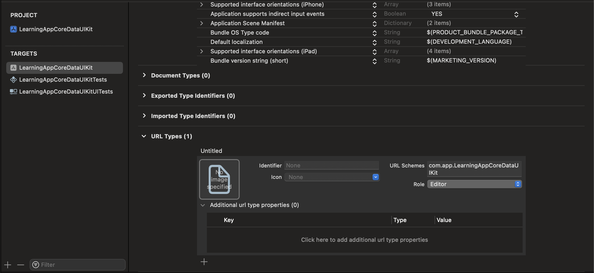

# oAuth2.0


This document covers oAuth2.0 implementation in iOS.
For detailed discussion on oAuth2.0 in general refer:
https://github.com/saurabh1088/notes/blob/main/oAuth/oAuth.md


## 1. Implementing oAuth2.0 in iOS


For implementing oAuth2.0 flow in an iOS app one need to take care of below steps.

### 1.1 oAuth Provider
There need to be some oAuth provider selected for the application for example 
- Google
- Facebook
- Apple
- Microsoft Entra ID
- GitHub
- Okta
- Amazon Cognito

### 1.2 Register app with oAuth Provider
The app requiring oAuth2.0 implementation need to be registered with the oAuth provider. This process is usually on some
console provided by oAuth provider where one can add the application and obtain a `client ID` and `client secret`.
`client secret` is optional.

### 1.3 Update App for redirect URL
One need to configure a redirect URL, using URL scheme or Universal Links. This redirect URL is required by authorisation
server to redirect back to app once user is successfully authenticated.

For example, a URL scheme can be added from application target's Info tab under *URL Types*

```
       <key>CFBundleURLTypes</key>
       <array>
               <dict>
                       <key>CFBundleTypeRole</key>
                       <string>Editor</string>
                       <key>CFBundleURLSchemes</key>
                       <array>
                               <string>com.app.LearningAppCoreDataUIKit</string>
                       </array>
               </dict>
       </array>
```



If using universal links, then one need to create a file named `apple-app-site-association` and place it at the root of
the applications domain or in the .well-known directory.

### 1.4 oAuth Flow in App
- Usually the starting step when app launches is to present a screen with a login/sign-in button.
- User taps login/sign-in button
- Button action triggers logic to call authorisation server URL
- Authorisation URL is called with required params like `client ID` generated at step 1
- Authorisation URL will redirect to oAuth provider URL for authentication, this need to be presented in a webview.
- User is authenticated on this webview
- Once authentication is successfull, authorization server will redirect to the redirect URL configured which takes flow
back to app
- Control comes back to app and call to authorisation server completes with authorisation code OR access token as per
grant type used.

### 1.5 Access Token
Once access token is received, all subsequent API calls, which are access controlled, need to have access token passed in
the request header. Access token hence need to be stored securely on the app. Usuallly keychain is used for storing access
token.

### 1.6 Refresh Token
Access tokens have an expiry. When Authorisation server returns access token to client, then it also includes a refresh
token. Access tokens are short lived, refresh tokens have a longer expiry. Use of refresh token is to get a new access token
from authorisation server once access token expires or becomes invalid.
So the app needs to implement logic, where access token is expired or invalid, then it needs to call authorisation server
endpoint to get new access token by providing the refresh token.


## 2. Libraries in iOS for oAuth2.0 Flow

1. AppAuth
https://github.com/openid/AppAuth-iOS

AppAuth library is available for following Apple platforms:
- iOS
- macOS
- tvOS

2. oAuthSwift
https://github.com/OAuthSwift/OAuthSwift

