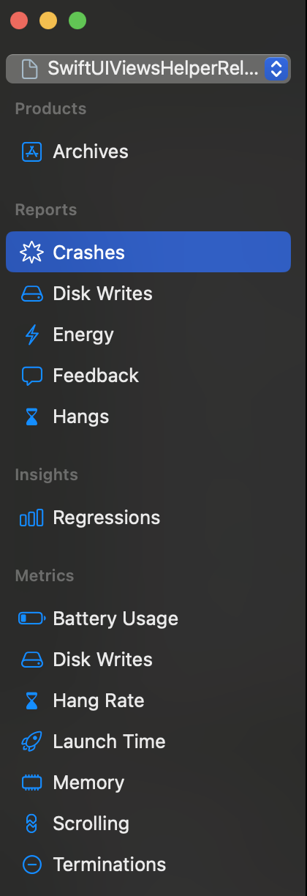

#  Crashes

wwdc : https://developer.apple.com/videos/play/wwdc2018/414/
Understanding Crashes and Crash Logs

The point where the execution reaches where only option is to crash, then when using Xcode in debug mode, the debugger receives
a signal that the app is about to crash and debugger pauses the app. This is when we can see the execution paused in Xcode
and can view the stack trace.
Now when we are not attached to the debugger, the operating system will capture the backtrace in plaintext and save it out
to disk in human readable crash log. Now the release build logs won't be as readable, it will consist a list of binary names,
which is the unsymbolicated crash log. As Xcode takes care of symbolicating crash logs, we see the details of methods, class
name, line number etc.


## 1. What are the reasons crashes can happen due to OS deciding to terminate application?
- Watchdog events
- Device overheating
- Memory Issues
- Invalid code signature

Operating system may decide to kill the application at launch itself if the application took too long to launch. This may
also result in app store rejection. Obviously to avoid launch timeouts one needs to test the app properly before submitting
to app store but the launch timeout watchdog is disabled in Simulator and it is disabled in the debugger. So watchdog timeout
will not be observed in simulator and with debugger attached. So one needs to test app on device without debugger.


## 2. How to view crash logs on Xcode for your apps in TestFlight and AppStore?
Got to Xcode -> Window -> Organizer
Choose App and one can view crash logs, hang logs, etc.
Xcode organiser shows a bunch of information about the app. Following screenshot shows options available:



From Xcode organiser one can view a lot of information about crashed like:
- Symbolicated crash logs
- Option to open crash logs in project
- Some statistics about crash like how many devices affected, distribution across os versions
- Feedback from TestFlight testers if they have submitted for TestFlight builds
- Option to share crash logs as a link to someone within team
- Upto 1 year worth of crash logs are available


## 3. How can one share logs from device?
Device, if is connected to Xcode, then once can use Xcode's Device menu to view logs. 
Also on device one can view logs under :

```
Settings -> Privacy & Security -> Analytics & Improvements -> Analytica Data
```

Logs on device at this location usually have app name in the file name itself. One can select a log and it shows details
of logs. Also there is an option to share those. One can tap share option to reveal share options available and share logs. 

## 4. Symbolification
1. Upload symbols with the app, this will ensure that server side symbolification works.
2. Save the app archives, as archives contains a copy of the debug symbols, the dSYMs. Xcode uses spotlight to find these dSYMs
and perform local symbolification when it's necessary automatically.
3. If app is uploaded which contains bitcode, then one should use the archive organizer download debug symbol button to
download any dSYMs which comes as part of store side bitcode compilation.

Crash log files contains much more information than just the stack trace.


## 5. What are watchdog events?

### 5.1 Memory Errors
What memory errors look like in crash logs.

Memory error can occur due to:
- Reference counting of an object being over-released.
- Using an object after it has been freed.
- Buffer overflow, like when there is a byte array or C array and that array is accessed out of bounds.

Exception type in crash logs in these errors is usually
EXC_BAD_ACCESS (SIGSEGV - SEG Violation Signal)
Also crash logs will give the invalid memory address which was accessed at the time of crash.
The invalid address itself sometimes will contain usefule information
In stack trace one might observe call made to function *objc_release* and also possible *objc_dispose*
One can look at the stack trace to track funtion performing the bad access.

1. EXC_BAD_ACCESS
This usually means:
- either we are writing to memory which is read only.
- Or we are reading from memory which doesn not exists.

### 5.2 objc_release
This function is part of implementation of reference counting in Objective C and some Swift objects.
*objc_release* reads the isa field and then dereferences the isa field to get to the class object and perform method lookup.
When object gets freed, then instead of isa, there is a rotated free list pointer. Now when objc_release will try to read
isa field, it will instead get rotated free list pointer, which when dereferenced crashes the app.

### 5.3 objc_dispose
This is a function in Objective C runtime which is used to deallocate objects.

### 5.4 ivar_destroyer
ivar_destroyer function is part of Swift code. This function cleans up the properties, cleans up the ivar storage of an object
when the object is being deallocated.
This is a compiler generated function, so one might see ivar_destroyer called in crash logs stack trace, but we won't get
to know which property was being destroyed.

### 5.5 lldb on Mac Terminal
One need to have following to analyse crash log inside debugger session provided by running lldb command on terminal:
- The crash log
- The app
- dSYM

2. Unrecognized selector exception
Sometimes an object is deallocated but the reference is still being used after the deallocation. Now if another object
occupies the same memory address space as the deallocated object, the usage of previous object's reference will result
in this exception and crashes related to it.

3. abort() inside malloc/free
This is another reason of memory error leading to crashes, where abort() is called inside memory allocator itself, i.e. inside
the malloc or free functions. This is due to precondition inside the memory allocator. This may be due to heap datastructure
of the malloc memory allocator itself gets corrupted by a memory error thereby leading to halting of process. Or this maybe
due to incorrect usage of malloc APIs, like if one frees an object twice in a row, then the malloc allocator can recognize this
as double free leading to immediately halting the process.


## 6. Multithreading Issues
Some of the memory corruptions could be result of multithreading issues.
If in crash logs one observes same class appearing for multiple thread, then this could be the case of multithreading issues.
One can use *Thread Sanitizer* to analyze some of the issues arising due to multithreading.


## 7. So what's a dSYM?

dSYM stands for *debug symbols*
When code is compiled then symbols are generated, these symbols are class names, global variables, functions etc. The association
of these symbols with file name and line number where these are defined creates a debug symbol.
Debug build place these debug symbols inside the compiled binary itself, this is by default. However the release build
places these debug symbols in a separate file dSYM, reducing the size of the distributed app.

So in order to understand dSYM files one needs to understand debug symbols.

Debug symbols as mentiond above contain information about the mapping of a binary with that of the source code. A debug symbol
contains information which maps the instructions in compiled binary to its corresponding variable, function, or line in
the source code.

Debug builds are larger and slower, as these contain debug symbols information.

Every binary in an app, for example the app's main executable, frameworks, app extensions etc have their own dSYMs. Compiled
binary and their dSYM are associated via a build UUID. A binary and a dSYM is only compatible if the UUID matches.


## 8. .ips files : NEW
These are crash reports generated by apps which store data as JSON in files with .ips extension. File format was introduced
in iOS 15.


## 9. How to debug app crashes?

### 9.1. Breakpoints

### 9.2. Exception Breakpoints

### 9.3. Console Log

### 9.4. Variable View

### 9.5. Crash reports in analytics

### 9.6. LLDB

### 9.7. Device's container

### 9.8. View hierarchy


## 10. Examples explored at
https://github.com/saurabh1088/SwiftUI/tree/main/SwiftUILearnings/Debug


## 11. One has received .ips file which is not symbolicated. How to symbolicate it and view crash logs?
If dSYM file is available, then when .ips file is attempted to open with Xcode, Xcode should be able to symbolicate and
enable showing crash logs.
One can try renaming .ips file to end with extension .crash and try opening.

If Xcode is not able to symbolicate, then one can try to symbolicate manually using command line tool *symbolicatecrash*
following below steps.

1. Check if *symbolicatecrash* command line tool is available running below command:
```
find /Applications -name symbolicatecrash
```
2. Above command should give path like below if tool is available:
```
/Applications/Xcode.app/Contents/SharedFrameworks/DVTFoundation.framework/Versions/A/Resources/symbolicatecrash
```
3. *symbolicatecrash* requires environment variable *DEVELOPER_DIR* to be set, set it executing below command:
```
export DEVELOPER_DIR=/Applications/Xcode.app/Contents/Developer
```
4. Execute *symbolicatecrash* command by providing path for .ips and dSYM files.
```
/Applications/Xcode.app/Contents/SharedFrameworks/DVTFoundation.framework/Versions/A/Resources/symbolicatecrash path/to/app.ips path/to/app.dSYM > SymbolicatedReport.crash
```


## 12. How to get and view crash logs for an iOS App?

### 12.1 Xcode Organizer
### 12.2 TestFlight
### 12.3 Devices
### 12.4 Third party crash reporting tools
### 12.5 Xcode debugger


## An Expert Guide to Analyzing Crashes in Production & Troubleshooting Firebase Crash Reporting

“How do we effectively analyze app crashes in production, and what are the common reasons why crashes might not be reported by Firebase Crashlytics?”

⸻

🛠 1. Analyzing Crashes in Production

⸻

🚨 The Importance of Crash Reporting

Why do we need it?
	•	User Experience: Crashes are the single most destructive factor to user trust. Even one unresolved crash can lead to churn.
	•	Visibility: Production crashes often occur in edge cases not reproducible in dev or test environments.
	•	Prioritization: Helps focus engineering effort based on crash frequency, affected users, and app lifecycle stages.

Without crash reporting, you’re essentially flying blind in production.

⸻

🔧 Primary Tools & Approaches

✅ Apple’s Native Mechanisms

📈 App Store Connect (Crashes Organizer)
	•	Shows crash logs from apps installed via App Store or TestFlight.
	•	Auto-symbolicated if dSYM is correctly uploaded.
	•	Less detailed than Firebase, but critical for releases via App Store.

📊 MetricKit
	•	Introduced in iOS 13+.
	•	Provides OS-level insights: crash diagnostics, CPU usage, memory pressure, battery usage, and more.
	•	Collected via MXMetricManager APIs.

Ideal for catching watchdog terminations and thermal kills missed by typical crash reporters.

📂 Device Logs (.ips crash reports)
	•	You can extract .ips files from user devices via:
	•	Settings → Privacy → Analytics → Analytics Data
	•	Apple Configurator / Console app
	•	Use Xcode’s symbolicatecrash tool or open in Organizer for analysis.

⸻

☁️ Third-Party Crash Reporting Tools

| Tool                | Notable Features                                                        |
|---------------------|-------------------------------------------------------------------------|
| Firebase Crashlytics | Real-time crash tracking, breadcrumb logging, integrates with Analytics |
| Sentry              | Excellent frontend + backend integration, user session tracing          |
| Instabug            | In-app bug reporting with screenshots and logs                          |
| Bugsnag             | Auto-detects regressions, tracks release health                         |


🔁 Pro Tip: No one tool is perfect. I often combine Crashlytics + MetricKit + App Store Connect for maximum coverage.

⸻

📄 Interpreting Crash Reports

Crash logs can feel cryptic, but once you know what to look for, they become powerful.

🔍 Key Elements of a Crash Report
	1.	Exception Type / Code
	•	EXC_BAD_ACCESS (SIGSEGV): Access to invalid memory – most common (nil/unretained pointer).
	•	SIGABRT: Usually indicates an uncaught exception or failed assertion.
	•	SIGILL, SIGTRAP: Often triggered by corrupt binaries or security violations.
	2.	Faulting Thread / Backtrace
	•	Look for the thread where the crash occurred.
	•	The backtrace shows which methods led up to the crash.
	3.	Binary Image / Symbolicated Methods
	•	Requires correct dSYM files for mapping memory addresses to method names.
	4.	Device and App Context
	•	App version
	•	OS version
	•	Device model
	•	Last user actions (breadcrumbs)

🧬 Symbolication

To make crash reports human-readable, we must symbolicate them using dSYM files.
	•	If you’re using Firebase:
	•	Upload dSYM automatically via Xcode Run Script Phase.
	•	Or manually via Firebase Console or CLI.

⚠️ If dSYM is missing, your crash reports are just noise.

⸻

🧪 Debugging Strategies

Even without direct debugger access, there are effective ways to isolate and fix production crashes:
	•	Use Breadcrumbs & Custom Logs: Crashlytics shows logs right before the crash.
	•	Create Reproduction Scenarios: Based on crash patterns (device/OS/version).
	•	Review Recent Changes: Check crash timestamp vs code commits.
	•	Simulate in Release Mode: Many crashes (esp. threading/memory) only occur in optimized builds.

🎯 Always test crash reproduction on a physical device, not just simulator.

⸻

🚫 2. Reasons Crashes Might Not Be Reported in Firebase Crashlytics

It’s frustrating when you know the app crashed, but Crashlytics shows nothing. Here’s why that might happen.

⸻

🔄 Common Integration Issues

🔍 SDK Initialization Order

Firebase must initialize before anything else — or it misses early crashes.

FirebaseApp.configure()

Ensure this is the first thing in AppDelegate.

📁 Missing GoogleService-Info.plist
	•	Plist must be in the correct target and bundled in release builds.
	•	Check that it is added under Build Phases → Copy Bundle Resources.

⚙️ Missing dSYM Upload Run Script

Ensure this is in Xcode Build Phases:

"${PODS_ROOT}/FirebaseCrashlytics/upload-symbols" -gsp "${PROJECT_DIR}/GoogleService-Info.plist" -p ios "${DWARF_DSYM_FOLDER_PATH}/${DWARF_DSYM_FILE_NAME}"

🛑 Without this, symbolication fails.

⸻

🧩 Symbolication Problems
	•	Bitcode Enabled: If Bitcode is enabled, dSYMs are generated on Apple’s side. You must download them manually from App Store Connect.
	•	Firebase won’t symbolicate crashes unless the correct UUID-matched dSYM is uploaded.

⸻

🌐 Network & Lifecycle Limitations
	•	Crash Upload Requires App Relaunch + Network
	•	Crashlytics uploads on next launch.
	•	If user deletes the app or never reopens it, the report is lost.
	•	App Crashes Before Firebase Starts
	•	e.g., Crash in static initializer or early Obj-C +load methods.
	•	Network Issues
	•	Crash reports queue until internet is available, but can be lost if queue is cleared or app uninstalled.

⸻

👤 User Privacy Settings
	•	Firebase Crashlytics respects user opt-out from analytics/crash reporting.
	•	Check for:

Crashlytics.crashlytics().setCrashlyticsCollectionEnabled(true)

	•	GDPR or App Tracking Transparency may restrict data collection.

⸻

💀 Crash Types That Firebase Can Miss

🕐 Watchdog Terminations
	•	System force-kills app for:
	•	Main thread blocking > 8s
	•	App taking too long to launch
	•	Not considered “crashes” by Crashlytics

➡️ Use MetricKit to catch these.

💣 SIGKILL / Manual Terminations
	•	Crashes due to memory pressure, background execution limits, or process killed.
	•	Not logged by Crashlytics as it doesn’t get a chance to write.

⸻

🧪 Debug vs Release Builds
	•	Many crashes only occur in release builds due to:
	•	Optimizations
	•	Different memory layouts
	•	Stripped logging/assertions

Always test your release builds rigorously before submission.

⸻

✅ Best Practices Recap

🔍 Area	✅ Best Practice
Crash Reporting Setup	Initialize Firebase early, ensure dSYM uploads
Testing	Test crash reporting in real release builds
Multiple Tools	Use Firebase + MetricKit + App Store reports
Debugging	Use breadcrumbs, stack traces, user context
Symbolication	Never ship without dSYM verification
Edge Cases	Detect watchdog, ANRs, and soft crashes too


⸻

📌 Final Thought

“A production crash is a customer support issue, a reputation risk, and a business threat — not just a bug.”

As a senior developer, your job is not just to fix crashes but to build systems that surface them reliably. Treat crash reporting with the same seriousness as your CI/CD pipeline or code reviews.

⸻

Let me know if you want a ready-to-use checklist or sample implementation code for Firebase Crashlytics in Swift.

## 14. TODOs

- [ ] 1. Network link conditioner

