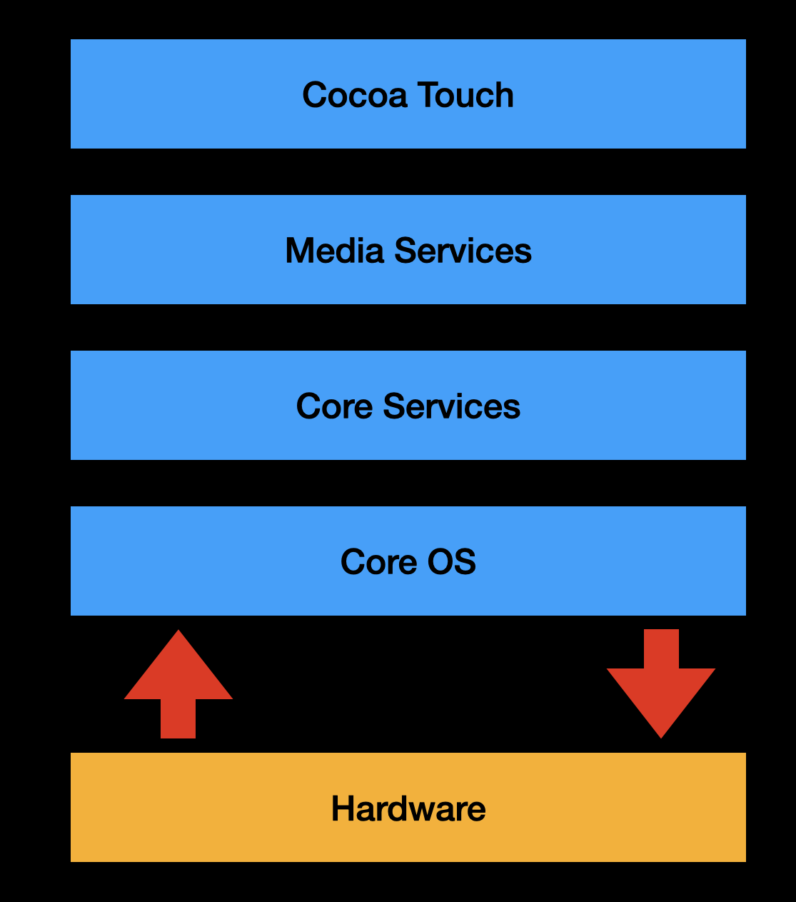

#  QnA

## 1. Explain iOS Architecture.

iOS Architecture consists of four layers as shown in below diagram.



### Core OS

At the core of iOS sits XNU Kernel.
This layer is directly on top of device's underlying hardware. This layer is responsible for basic operating system services
like

- Memory management
- Handling file system
- Threading and concurrency
- Low level networking
- Access to external accessories
- Security & Encryption features like Secure Enclave
- Device drivers helping communicate with harware components like CPU, GPU, storage etc.
- Components for power management
- Inter Process Communication (IPC) 

Core OS includes below frameworks and more

- Core Bluetooth Framework
- External Accessories Framework
- Accelerate Framework
- Security Services Framework
- Local Authorization Framework

### Core Services

- GCD
- iCloud Storage
- In-app purchase

Core Services includes below frameworks and more

- Address Book Framework
- Cloud Kit Framework
- Core Data Framework
- Core Foundation Framework
- Core Location Framework
- Core Motion Framework
- Foundation Framework
- HealthKit Framework
- HomeKit Framework
- Social Framework
- StoreKit Framework

### Media Services

This layer helps in handling audio, video and graphics.

Media Services includes below frameworks and more

- ULKit Graphics
- Core Graphics Framework
- Core Animation
- Media Player Framework
- AV Kit
- Open AL
- Core Images
- GL Kit


### Cocoa Touch

This is the application layer, this functions as interface to users and includes
touch and motion capabilities.

Cocoa Touch includes below frameworks and more

- EventKit Framework
- GameKit Framework
- MapKit Framework


## 2. What is UIViewController?

UIViewController in UIKit is responsible for managing view hierarchy for the app.


UIViewController is subclassed and inherited viewcontrollers are created to manage an app's view hierarchies. One doesn't
need to create instances of UIViewController directly.

As UIViewController inherits from UIResponder, hence it's also a responder object and is part of responder chain.

### Responsibilities of UIViewController

- Updating the views it manages
- Handling user interaction events
- Resizing views and managing layout
- Coordinating with other objects and other viewcontrollers in app
- Performing segues and navigating to other viewcontrollers


### UIViewController as responder

- UIViewController inherits from UIResponder. 
- So techincally a UIViewController object is also a UIResponder object.
- UIViewController objects are part of responder chain.
- When none of the UIViewController's views handle an event, then UIViewController
has option of handling it or passing it to superview.

### UIViewController placement in responder chain

UIViewController object in responder chain is inserted in between the viewcontroller's
root view and root view's superview.


### UIViewController's *view* property

- Job of UIViewController is to manage a view hierarchy.
- The root view of this hierarchy is stored in UIViewController's view property.
- UIViewController will load *view* lazily, i.e. when the view property is accessed
for the first time then only viewcontroller's views are loaded or created.
- Initially the value of *view* is nil. If one accesses this property when value is
nil, then viewcontroller will automatically call loadView() method and return the
resulting view. 

### What is root viewcontroller?

The viewcontroller owned by the window is the app's root viewcontroller.


## 3. Can one access UIViewController's *view* property?

Yes one can access UIViewController's *view* property, the only caveat to accessing
it is that if this property have value nil then accessing this property can cause
the view to be loaded automatically, as the viewcontroller will automatically call
loadView() method and return the resulting view.

Hence safe way to access *view* property is to use property *isViewLoaded* which
tells if the view is currently in memory or not. Accessing *isViewLoaded* will not
force calling loadView() method or trigger loading of view.


## 4. How do you specify *view* for a UIViewController?

Following are ways to specify *view* for a UIViewController subclass. We mention
subclass here as UIViewController is rarely instantiated and any app will subclass
it to provide implementation and then provide *view* using one of the below approach.

All three approaches mentioned below have same result which aims at creating views
for viewcontroller and expose the hierarchy through *view* property.

### Storyboards

### NIB Files

### loadView()

## 5. Why is it important for URLSession's dataTask method completion handler to update UI always on DispatchQueue.main block?

The completion handler associated with URLSession's dataTask method gets called on
a different queue than the one created the task in first place so any work in the
completion handler updating UI should be explicitly placed on the main queue.


## 6. What are @IBDesignable and @IBInspectable in Swift?

TODO : Hands on with IBDesignable and IBInspectable
TODO : Read throught and try out https://nshipster.com/ibinspectable-ibdesignable/

### @IBDesignable

@IBDesignable is an attribute which when is applied to a UIView or NSView subclass,
tells Interface Builder in Xcode to render the view directly in the canvas. This
allows seeing how that custom views will appear without building and running the
app after each change.

### @IBInspectable

XIB/NIB and Storyboards have an old feature - user-defined runtime attributes. These
were accessible from identity inspector in Xcode's Interface builder.
@IBInspectable properties provides new access to this old feature. 

@IBInspectable is an attribute which help exposing a property to Interface Builder
in Xcode. When a property is marked with @IBInspectable attribute, then it becomes
editable in Attributes inspector within Interface Builder in Xcode. This implies that
one can set or adjust it from Interface Builder, without writing code.

Example :
https://github.com/saurabh1088/uikit/blob/main/UIKitLearnings/UIKitLearnings/BezierPaths/RectangularView.swift


## 7. What are various options to configure a viewcontroller before it is shown? OR How to provide it's dependencies?

### UIViewController with NIB
- If UIViewController derives it's view hierarchy from a NIB file, then either it's dependencies could be marked to be
implicit unwrapped optionals, just like IBOutlets. This way these dependencies can be provided when viewcontroller is
presented or pushed right after instantiating it from nib file.

- Here one can also create an initialiser and within that initialiser call it's superclass' `init(nibName nibNameOrNil: String?, bundle nibBundleOrNil: Bundle?)`. For example look at below viewcontroller

https://github.com/saurabh1088/uikit/blob/main/UIKitLearnings/UIKitLearnings/ViewControllerLearnings/ViewControllers/NibInstantiatedViewController.swift

### UIViewController in storyboards
- Use `prepare(for segue: UIStoryboardSegue, sender: Any?)` and in it's implementation assign dependencies.
- Use `@IBSegueAction` and configure UIViewController with initialiser

Example for `@IBSegueAction`
https://github.com/saurabh1088/uikit/blob/main/UIKitLearnings/UIKitLearnings/ViewControllerLearnings/ViewControllerInitOptionsViewController.swift


## 8. prepare(for segue: UIStoryboardSegue, sender: Any?) vs @IBSegueAction
Benefits of using @IBSegueAction
- @IBSegueAction helps in cleaning up code as `prepare(for segue` ends up having multiple checks for segue identifiers.
- Viewcontroller can have initialiser defined for it's dependencies, and those dependencies could be marked as private.
- Dependencies could be marked as let constant, instead of marking as var which is required when declared as implicitly
unwrapped optionals
- If required for testing, Viewcontroller can be initialised with all dependencies for test.

## 9. What's the difference between these declarations?
```
func feed<A>(_ animal: A) where A: Animal

func feed(_ animal: some Animal)
```

Both are identical. The bottom one reduces the syntactic complexity as the top one with the type parameter and where clause
looks too complex.


## 10. What is some keyword in Swift?
With *some* there is a specific underlying type that cannot vary. So suppose we have a protocol, then if we want to declare
an array which contains elements conforming to protocol declaring like [some Protocol] would not work as then all the elements
in the array needs to be of same type. So [some Protocol] doesn't express the right thing. What needs to be used here is
[any Protocol].
[any Protocol] is available from Swift 5.7

|some|any|
|---|---|
|Holds a fixed concrete type|Holds arbitrary concrete type|
|Guarantees type relationship|Erases type relationships|

Write some by default, and use any when one needs to work with arbitrary values like storing in an array any types conforming
to a protocol.

*any* provides type erasure, which allows you represent heterogeneous collections, represent the absence of an underlying
type, using optionals, and make the abstraction an implementation detail.


## 11. In Swift can we have stored properties in an enum?
NO
In Swift, Classes and Structures only can have stored properties.

Let's explore why enum can't have stored properties.
As per definition an enum is a model custom type which defines a list of possible values.
Check _Example 8 : Can Enum have stored properties._ for details at link : [Example](https://github.com/saurabh1088/swift-playgrounds/blob/main/Swift.playground/Pages/Enumerations.xcplaygroundpage/Contents.swift)


## 12. What is a namespace?
Namespace in software engineering refers to a container with a set of classes, structures, functions etc inside it with
goal of organizing code and avoiding name conflicts. For example in a project we have a networking module for which we
declared a struct Utils with some utility functions. Then later while developing style guide we again want to add some
utility functions, so either we can add these style guide common functions to same Utility struct added for networking, which
can work fine but it will make Utility struct having multiple things in one and very large. One can use to add extensions
and organise code, from code organisation point of view it can work, but while using it will not make a difference visually.

In this situation the concept of namespace helps. Some languages have built-in support for namespaces. For example in C++
we have a keyword *namespace* for this purpose. In Java concept of namespace is achieved using packages.

In Swift one can use enums to achieve concept of namespace.
Check example for details : [Example](https://github.com/saurabh1088/swift-playgrounds/blob/main/Swift.playground/Pages/Enumerations.xcplaygroundpage/Contents.swift)


## 13. Why do we need to use keyword indirect for Swift's recursive enumerations?
When we define an enum in Swift having associated value, Swift will need to determine the required memory based on the
type of associated values. Now if the assciated value type is simple types like String, Int, Double etc. then Swift will
be able to figure out memory requirement.
Now Swift enums are supposed to be having value semantics. As long as we are dealing with simple enums i.e. with no associated
values, it's all good. Swift compilor will be able to know the memory requirement. Even in case of Swift enums with associated
type where the associated type is having simple data types, compilor can figure out memory requirement by considering the
memory for the case which needs the largest memory.
This however becomes complicated when we talk about recursive enums. For a recursive enum as the enum's associated value
can be of the type of enum itself, it can go on recursively and becomes difficult to guess the memory requirement.
So now as the compiler can't calculate the memory requirement in this case to proceed with stack allocation, it will instead
treat this case as associated values as pointers to heap allocation. This is where the keyword *indirect* comes which states
that the associated value for this case is indirectly stored on heap.


## 14. What is the relevance of instancy property, capacity, of an Array in Swift and how does it differs from count?
Array's capacity is an instance property on Array, it gives a count of number of elements array can contain without allocating
new storage. For Array the compiler will reserve certain amount of memory to hold its contents. When one appends more elements
to the Array then if more storage is required then the new storage allocate is in multiples of old storage size. So initially
the capacity and count when array is initialized is usually equal, but capacity can grow if more elements are inserted into
array or appended or removed from array.
This means the new storage follows an exponential growth strategy. For example if any array was initialised initially with
5 elements, once we append one more element i.e. the 6th one the capacity will now be 10, one appending 11th element it
will become 20, then 40 and so on.
So it goes on like : 5 -> 10 -> 20 -> 40 -> 80 -> 160 ...
Check example for details :
[Example](https://github.com/saurabh1088/swift-playgrounds/blob/main/DataStructures.playground/Pages/Arrays.xcplaygroundpage/Contents.swift)


## 15. Swift Arrays and contiguous region of memory allocation.
Arrays in Swift hold their values in contiguous region of memory. This is true when elements type the Array is holding is
of value semantics. When the elements type is reference type, then it may or may not hold value in contiguous region and instead
opt for reference in NSArray.
Now for the most part when Array is storing values in contiguous region, then when say we append some value to the array
then if current region is not sufficient to hold all values, a fresh, larger region of memory is allocated with previous
values copied into it along with new values appended. Now as the previous values will be copied over this makes the operation
of append of complexity O(n). This means the worst time it takes to append will grow in proportion to the size of array.
Now we know that append or insert cause array allocation to grow exponentially. This exponential growth means reallocations
should become rarer as one appends more and more elements.
One can use *reserveCapacity(_:)* method to avoid multiple reallocations when we know ahead of time values needed to be appended.
One can call *reserveCapacity(_:)* before appending and provide some minimum capacity for append to follow.


## 16. How is inserting an element into an array is compared to appending one?
Arrays being in a contiguous region of memory means that an insertion operation can be costly and be of the order of O(n).
Though appending initially can be costly due to reallocation, but appending multiple times have subsequent improvements.


## 17. What is meant by saying Swift arrays are Copy-on-Write?
Copy-on-Write is a optimization technique used by Swift for Arrays. What this means is that suppose there is an array created
named arrayA and then we assign this to another array arrayB, arrays being value types will mean that both arrays are not
pointing to anything but contents should get copied when assignment was done. However to optimize the contents are not copied
till the time one actually makes any changes to either arrayA or in arrayB.
So Copy-on-Write optimization means that multiple copies of array will share the same storage unless one of the copies is
modified, in which case the modified one will get a copy of itself.
In terms of performance this means when we have a bunch of arrays sharing a storage then any first mutating operation will
incur the cost of copying.


## 18. What is an ArraySlice? Why should one not store a slice longer than one needs?
ArraySlice is a view onto Arrays. It's a generic struct behaving very much same as the normal Array. ArraySlice can reference
a part of another Array's storage and pass it of as its own. This is helpful to make it fast and efficient to perform operations
on a section of larger array. ArraySlice doesn't copies elements of section it represents of the larger array, instead it
present a view onto the storage of larger array. ArraySlice offers same interface as that of normal array so one performs
same operations as one can on a normal array. 
ArraySlice can however allocate its own memory space but that defeats the purpose of using it.

One should not store an array slice longer than it is needed because slice holds reference to entire storage of the larger
array, not just the portion of which it is representing the view. So what this means is that it will increment the reference
count for memory of larger array and can lead to memory leakage.


## 19. What is meant by being first-class citizen in programming world?
This concept of first-class citizens was introduced by Christopher Strachey in the 1960s and this is a generic terms which
applies to many programming languages and not restricted to a few. After introduction of this term, the definition was given
modern touch Robin Popplestone to include following conditions which qualifies one to be a first-class citizen
1. Can be passed into functions
2. Can be returned as function result
3. Can be assigned to variables
4. Can be tested for equality

For example a function in a programming language can be said to be first-class if it can be treated like any variable and
passed as an argument to other functions and returned from funtions and can be assigned to other variables.
Functions are first-class citizens in languages like:
- Python
- JavaScript
- Swift


## 20. What all are treated as first class types in Swift programming language?
In Swift following are treated as first class :
- Actors
- Classes
- Structures
- Functions
- Closures
- Enumerations
- Tuples
- Protocol Types


## 21. What is ABI Stability?
ABI stands for Application Binary Interface.
It's an interface as the name suggests. This interface defines everything needed for binaries to interact or communicate.

Swift 5 release introduced ABI Stability to Swift.
ABI Stability is required for each platform/operating system onto which apps or libraries are compiled and runs.
Swift's ABI stability is at present completed for Apple's platforms.

ABI Stability gurantees, for example, from Swift 5 onwards, an app built with Swift 5 or say in future higher version, will
be able to communicate with a library built using different Swift version.
To elaborate, suppose we have an app built using Swift 5. Now if we have three different systems with Swift standard library
versions 5, 5.1 and 6 respectively, then our app will be able to run on all three of the systems.
Previously what used to happen was that the apps used to embed the Swift standard library in app bundle. Now with ABI stability
this is not required hence also making app bundle reduced in size.

https://www.swift.org/blog/abi-stability-and-more/


## 22. What is an unwind segue and how to set it up?
Unwind segue is opposite of normal segue as the name suggests. Unwind segue is used to handle the dismissal of a view controller.
Normal segue has a specific target which is the destination view controller, this destination is known before hand.
However for unwind segue, UIKit determines the target at runtime. Having UIKit determining the target at runtime gives
advantage and flexibility in how the navigation hierarchy is set up. One can have complex hierarchy of view controllers
presenting same child view controller. In this scenario one can skip adding complex logic to determine which view controller
to go back to once child view controller is dismissed, as the UIKit runtime target determining while using uniwind segue
simplifies the implementation.

### 23. How to set unwind segue
For example refer code at:
https://github.com/saurabh1088/ios/blob/main/LearningAppCoreDataUIKit/LearningAppCoreDataUIKit/Movies/MoviesViewController.swift

In this example the parent view controller, *MoviesViewController* is presenting *AddMovieViewController*. Unwind segue is
setup from *AddMovieViewController* back to *MoviesViewController*

In general one needs to define a method like below in the parent view controller where one wants to come back to after unwind
from child view controller.

```
@IBAction func unwindAction(unwindSegue: UIStoryboardSegue)
```

What this method does for the view controller in which it is defined is that it tell UIKit that this view controller is
a potential destination for an unwind segue. If there are multiple possible destinations then all should have this method.
Note, it is presence of this method which is important, the implementation can remain empty if nothing is required on unwind,
else one can utilise to perform any relevant task required as per requirement on dismissal.
Also presence of this method only will enable to create unwind segue from storyboard. As after adding this method, one needs
to create a segue in storyboard from child view controller's control trigerring segue to the Exit control. On control dragging
in storyboard from child view controller's control trigerring segue to the Exit control of child view controller, list of
action methods are prsented where one needs to choose the unwind action method.

### Behind the scenes
When unwind segue is trigerred, UIKit as mentioned above will determine the target at runtime, so what happens is that
UIKit will search in the current view hierarchy for a view controller which has implemented the IBAction method connected
to the unwind segue. It will try to find the closest parent view controller implementing the unwind IBAction method.
If UIKit is unable to find any appropriate view controller, then the unwind segue will fail silently, and the child view
controlller will remain on screen.


## 24. How to handle SSL pinning and authentication challenges while using URLSession?
SSL pinning and authentication challenges both are handled using URLSessionDelegate. One need to conform to URLSessionDelegate
and implement *urlSession(_:didReceive:completionHandler:)* method

```
optional func urlSession(
    _ session: URLSession,
    didReceive challenge: URLAuthenticationChallenge,
    completionHandler: @escaping @Sendable (URLSession.AuthChallengeDisposition, URLCredential?) -> Void
)
```

This method as per signature above, receives a URLAuthenticationChallenge.
*URLAuthenticationChallenge* is basically a challenge from remote server. *URLAuthenticationChallenge* has an instance
property *protectionSpace*. This *protectionSpace* property provides additional information and also tells about the
authentication challenge received, if that challenge is asking for credentials or verifying the server certificate for
SSL pinning.


## 25. How can one classify something in Swift as a module?
A module is a single unit of code which is built and shipped or distributed as a single unit. In code anything one can
import with the import statement can be termed as a module.
Also in Xcode for a project, each build target is also a separate module.


## 26. For a public class what will be the default access level of its properties and methods?
INTERNAL. It may appear it is going to be public, but actually it will be internal. Usually the access level trickles down
to the type's members as well. However there is exception in case of when the type is declared as public. For public type,
the default access level comes as internal. This way it prevents accidently exposing APIs which aren't meant to be public.


## 27. For an internal class what will be the default access level of its properties and methods?
Internal


## 28. What is the use case for defining a type to be private?
Declaring private is helpful for encapsulating implementation details.
One can define a private inner type to make internal data structure cleaner, however one doesn't need to expose these
details to outsiders, hence these can be declared as private.


## 29. If one has to design an App which shows a large number of images, then how efficiently one can design this?
For this use case, one can make sure to render thumbnail images of actual images on server and then download the thumbnail
version meanwhile the actual large versions are downloaded as those can take time. The larger version of image will only
be required once user selects the thumbnail, hence once can avoid unecessary large downloads.


## 30. Compare Alamofire and URLSession.
Alamofire is a popular networking library which aims at simplifying networking tasks.
It builds on top of Apple's URL Loading System. Means underneath it is using URLSession and it's players.

Alamofire advertises itself on it's ReadMe page in github as "Elegant Networking in Swift". Which takes to one obvious
difference and possibly advantage over URLSession, that the syntax is lot easier and one has to write less code compared
to using URLSession(considering using completion handler, latest async/await might comes to same or only marginally different)

Following are some features/advantages which one gets Alamofire over URLSession.

1. Certificate pinning is easier to implement.
2. Retrying request is easier.
3. It's used widely and is tested, so one can opt to use so as to not write networking code and skip testing.


## 31. What's the difference in UIView and CALayer?
In iOS world, every UIView is backed by a Core Animation CALayer. UIView is kind of a light wrapper on top of CALayer.
What UIView provides on top of CALayer is the support for user interaction.
CALayer is available for both iOS and macOS platforms. CALayer can be used without UIView as well to display content.
While working with UIView one may need to dig in deeper and access CALayer in some complex animations.

Main job of a CALayer is to
- Manage visual content
- Maintain information about geometry of its content like
    - position
    - size
    - transform

One can modify properties of CALayer to perform animations.

When working with UIView, the UIView assigns itself as a delegate to CALayer. This relationship cannot be changed.
When used in isolation, CALayer's delegate object can be provided.


## 32. How to optimize performance while working with UIView and CALayer?
1. View hierarchy should be optimized such that there is no unecessary overlapping of views. This is important so that
only a minimum number of required only views should get rendered.
2. Opaque views should be preferred as these help optimizing performance for rendering engine.
3. For complex animations one should leverage CALayer's animation capabilities as it is highly optimized and this reduces
load on main thread. CALayers are drawn directly on the GPU, utilising separate thread.
4. Views and layers should be loaded lazily. This improves initial load time and memory usage.
5. Avoid complex drawing logic in *drawRect* method of UIView. *drawRect* gets called multiple times and can lead to
performance issues. As an alternative one can use *CAShapeLayer* for vector based drawing.
6. Minimize offscreen rendering.
7. Rasterization : *shouldRasterize* property of CALayer.


## 33. What are options for static code analysis for Swift/Objectice C projects?
### 1. Xcode Static Analyser
- Xcode -> Product -> Analyse

### 2. SonarQube
`SonarQube` is an open source platform which allows one to continuously inspect and measure code quality. It provides
detailed analysis of code quality, security vulnerabilities, and technical debt.

`SonarQube` :
- Performs static code analysis to identify code quality issues without executing the code.
- Measures metrics like
    - Duplicate Code
    - Code complexity
    - Test coverage
- Can be integrated into CI/CD pipelines.
- Provides dashboard view displaying metrics and analysis.
- Supports wide variety of programming languages
    - Java
    - C#
    - C
    - C++
    - JavaScript
    - TypeScript
    - Python
    - Swift


## 34. How many types we have in Swift programming language?
Source : https://docs.swift.org/swift-book/documentation/the-swift-programming-language/types/

Swift has two kind of types:
1. Named Types
    - Classes
    - Structures
    - Enumerations
    - Protocols
2. Compound Types
    - Tuples
    - Functions


## 35. When does deinit is called?
- Deinit is called immediately before a class instance is deallocated.
- A deinit is available only for class types.
- One isn't allows to call a deinit, these are called automatically.


## TODOs

- [ ] Explain the differences between UIView and CALayer. How do you optimize performance when working with these components?
- [ ] Describe a situation where you had to deal with race conditions or deadlocks. How did you resolve it?
- [ ] Have you implemented data migration in Core Data? If so, can you describe the process?
- [ ] Give examples of how GCD and Operations were utilized in projects?
- [ ] Have you worked with dependency injection in iOS? How do you manage dependencies in your projects?
- [ ] Does opacity of a UIView has any impact on performance?
- [ ] What is rasterization?
