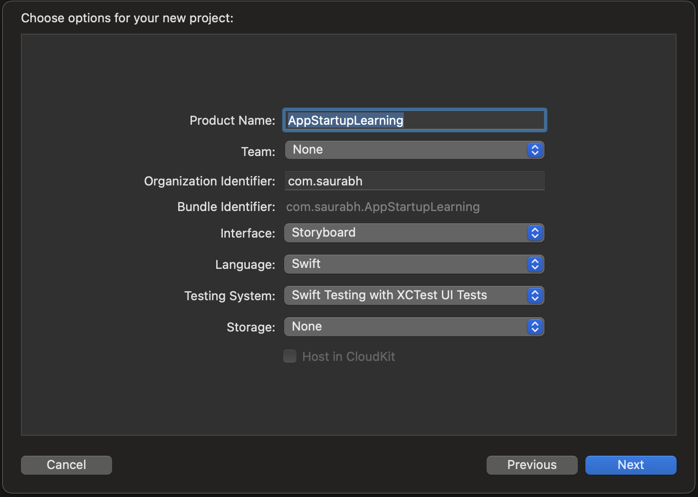
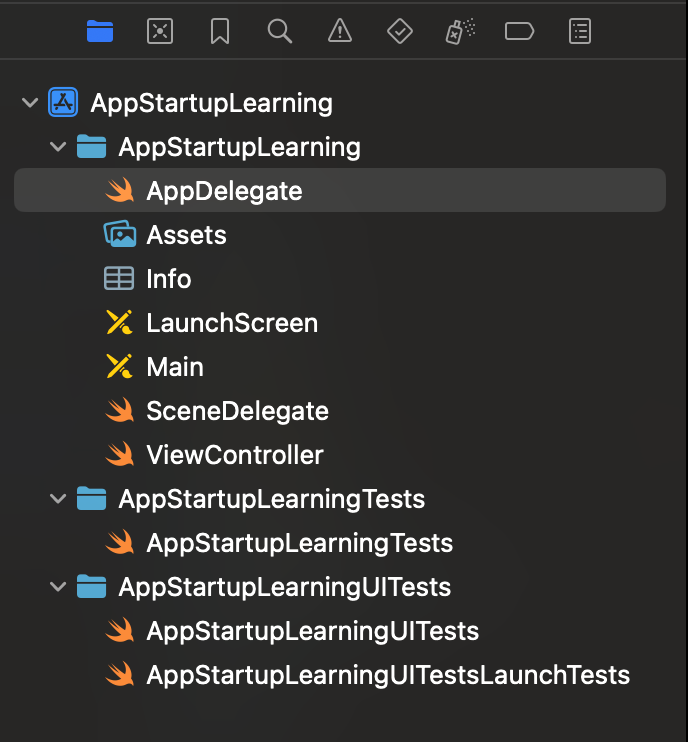

# App Startup

## AppDelegate vs SceneDelegate

### New freshly baked project choosing Storyboard as UI interface







- Created project has `AppDelegate` and `SceneDelegate` both.
- When app is installed and launched first time, following sequence of delegate methods are called

```
AppDelegate : application didFinishLaunchingWithOptions
AppDelegate : application configurationForConnecting
SceneDelegate : scene willConnectTo session with options
SceneDelegate : scene sceneWillEnterForeground
SceneDelegate : scene sceneDidBecomeActive
```

- Once app is installed and it is terminated and launched again without re-install following sequence is observed

```
AppDelegate : application didFinishLaunchingWithOptions
SceneDelegate : scene willConnectTo session with options
SceneDelegate : scene sceneWillEnterForeground
SceneDelegate : scene sceneDidBecomeActive
```

- App is installed fresh and launched, after launch, home button is pressed.

```
AppDelegate : application didFinishLaunchingWithOptions
AppDelegate : application configurationForConnecting
SceneDelegate : scene willConnectTo session with options
SceneDelegate : scene sceneWillEnterForeground
SceneDelegate : scene sceneDidBecomeActive
SceneDelegate : scene sceneWillResignActive
SceneDelegate : scene sceneDidEnterBackground
```

- App is installed fresh and launched, after launch, home button is pressed, after sometime app is launched again.

```
AppDelegate : application didFinishLaunchingWithOptions
AppDelegate : application configurationForConnecting
SceneDelegate : scene willConnectTo session with options
SceneDelegate : scene sceneWillEnterForeground
SceneDelegate : scene sceneDidBecomeActive
SceneDelegate : scene sceneWillResignActive
SceneDelegate : scene sceneDidEnterBackground
SceneDelegate : scene sceneWillEnterForeground
SceneDelegate : scene sceneDidBecomeActive
```


## Observations

- `application(_:configurationForConnecting:options:)` is called only when app is installed and launched for the first time
and for every subsequent launches it is not called.


## App states

### Not Running
- App is yet not launched OR
- App is terminated by the system
    - Can happen due to memory issue
    - Can happen due to app exceeding its allocated time to perform background task
- App has crashed due to some runtime exception
- User has terminated app from app switcher to kill it

From Not Running, an app can move to
- Inactive State
    - This when user taps to launch an app, the app briefly moves to inactive state befor it moves to active state
- Background State
    - If any background activity is trigerred due to location update or a push notification, app can launch directly into
    background state

States from which app can transition to Not Running state
- Active
    - User force quits the app
    - System terminated the app
- In-active
    - User force quits the app
- Background
    - Once background task is completed, app is terminated by system
    - User force quits the app
- Suspended
    - System terminated the app

### Inactive
- App is in foreground but is not receiving events
- App is in this state when it is just launched, it comes to foreground and is in inactive state
- App was in active state but it receives some temporary interruptions like phone call or notifications

### Active
- App is in foreground and receiving events

### Background
- When home button is tapped while app was in foreground it goes to background
- App can perform some task in background if it is scheduled and configured to do so, else it will be suspended

### Suspended
- App is in background (kind of in memory) but is not executing any code
- App can be terminated anytime by the system
