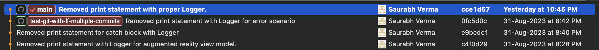
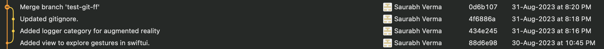

#  GIT

*git is free, git is open source. It is a distributed version control system.*


## Distributed Version Control Systems

In a Distributed Version Control Systems when one checks out a repository locally
then checked out content is not just the latest snapshot, instead it fully mirror 
the repository. Means one gets the complete repository locally with all its history.

This has a huge advantage for Distributed Version Control Systems as in case of
issues with remote hosting the contents, any of the locally checked out repository
can be used to back up and restore.


## GIT vs Other VCS like SVN

Apart from following distributed approach the way Git stores and thinks about
information is also very different. Most systems treat information as a set of files
and then changes to those files over time.

Git however doesn't stored information this way (i.e. file plus it's deltas over time).
In Git, information or data is more like a snapshots. Every time some changes are
made Git will take a snapshot and store a reference to that snapshot. In this way
for Git information or data is more of a stream of snapshots. 


## git merge : fast-forward vs no fast-forward

### Example :

We have a main branch, from which feature branches are created and merged back to
main branch. Suppose we create a feature branch from main and add few changes and
stage+commit+push those to feature branch.

main
feature_a
    - commit 1
    - commit 2
    - commit 3

Now our changes for feature_a are complete and we want to merge these back to main
branch. There are two ways to do this

- git merge using fast-forward (DEFAULT)
- git merge with no fast-forward

If merged from terminal the usual process is :

1. git checkout main
2. git pull (to make sure we have all changes from main)
3. git merge feature_a

The command (git merge feature_a) used in step no 3 will proceed with merge using
default strategy as fast-forward.

### git merge when used with fast forward

Below screenshot shows how branch revision history appears in Fork when fast forward
strategy is used. Here fast forward simply shows revisions added to main branch.
Nowhere it can be figured out where feature began and where it ended and where merge
was done. It also will be difficult if one were to revert the feature. Only way to
revert the feature would be to figure out all commits and revert those.



### git merge when used without fast forward

Below screenshot shows how branch revision history appears in Fork when fast forward
strategy is NOT used. In this case it's clearly visualised that a branch was created,
then some commits were added and finally it was merged. There is a merge commit as
well. This merge commmit can be reverted to revert the feature from main branch.

How to use no fast forward option?

Use command git merge with option --no-ff

For e.g. continuing the same example as above steps followed would be

1. git checkout main
2. git pull (to make sure we have all changes from main)
3. git merge --no-ff feature_a

What does --no-ff does?

- It causes merge to always create a new commit revision, even if the merge could 
have been performed with a fast-forward.
- This avoids loosing historical information about branch as can be seen in both
example screenshots from Fork, how it visualizes.
- Easily identiy what all commits went to the feature branch merged back to main.




## git stash

Often while working we need to go back to a clean working directory, this could be
due to switching to a different branch or wanting to test some behaviour on clean
codebase. In this case one needs to park local changes somewhere, this is when git
stash comes to help.
Git stash records the current state of the working directory. 

```
git stash
```

Stashes current working directoy changes

```
git stash list
```

Lists down all the modifications currently stashed away.

```
git stash show
```

Shows changes in stash similar to how git diff lists the changes against original.
This shows the stash content for the most recent stash.


## git branch

```
git branch
```

Lists down all the LOCAL branches and highlights the current one using asterisk *

```
git branch -a
``` 

Lists down all the LOCAL & REMOTE branches

```
git branch new-branch-name
```

Creates a new branch with name _new-branch-name_


## git reset HEAD~1 

```
git reset HEAD~1
```

This command will revert a local commit which is NOT pushed to remote yet. Sometimes
when a commit is done locally and then push is tried, the push may fail and ask for
first to take a pull, in this case one can revert local commit using this command
take pull first and then proceed with commit and push.

## git tag

```
git tag
```

Lists down all the tags, in alphabetical, not in the order those were created.


## How to create a tag in repository from a branch command line?

Suppose we need to create a tag from branch named *branch_name*. One need to checkout the branch and then use command
git tag -a with proposed name for the tag which is here *v1.0.0* in below example.
After this local tag will get created which needs to be pushed tp remote repository using command git push origin v1.0.0

Tags in Git can be *lightweight* OR *annotated*

### lightweight tag
It is just like a branch except once created won't change. Behind the scenes it is just a pointer to the specific commit
where tag was created.

### annotated tag
These are stored as full objects in Git database. These contain more information as well like who created the tag etc. The
*-a* option in command *git tag -a v1.0.0* is what tells git to create annotated tag.

```
git checkout branch_name

git tag -a v1.0.0

git push origin v1.0.0
```

## Initialize a git repo locally and push to remote

1. Create folder for e.g *test-repo*
2. From *test-repo* execute command
```
git init
```
3. Add required files, content to the folder *test-repo*
4. Commit changes
5. Create a repository on github account and get the repo url
6. Execute below command from *test-repo*
```
git remote add origin git@github.com:saurabh1088/test-repo-created-on-git-hub.git
```
7. Execute below command from *test-repo*
```
git push -u origin main
```

Note: The  can differs of folder created locally and repository created on github, that will not cause any issue. One can
choose same name, or if choosen differently then can delete locally and clone repo created after completing all steps. 